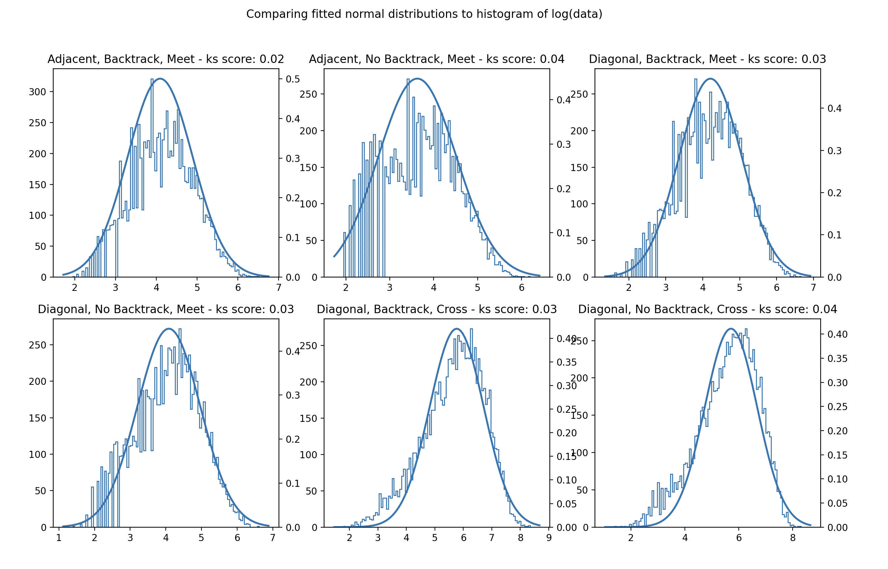

# Ants
> Two ants start in opposite corners of a regular chessboard. Every 10 seconds, they move from the center of the square they're on to the center of an adjacent square. How long until they both land on the same square? How long until their paths cross (Ant A moving from square K to L and Ant B moving from square L to K)? What happens if we allow the ants to move diagonally? What happens if we restrict ants from moving to their immediately previous square?

### **Approach**

1) Run N simulations for the different input cases.

2) Fit a distribution to the sample generated for each case using distfit (https://pypi.org/project/distfit/)

3) Estimate the time taken as the mean of the distribution that best fits.

4) Based on initial analysis, force a lognormal distribution on each sample. This allowed for a comparison of the impact of each variable in the problem: Backtrack, Diagonal and success condition (meet or cross).

### **Results**

>Note: The results below can be replicated by using seed 1 `random.seed(1)` in `main.py` or similar results can be obtained by running the code directly without forcing a seed

For each case, 10,000 simulations were performed (this number provided a right balance for speed and statistical confidence), and the results are summarised below:

#### **Full Summary**
<table><tr><th colspan="3" valign="top">Test Name</th><th valign="top"></th><th colspan="2" valign="top">KS D-statistic (goodness of fit)</th><th colspan="2" valign="top">Expected time (seconds)</th></tr>
<tr><td valign="top">Backtrack</td><td valign="top">Diagonal</td><td valign="top">Objective</td><td valign="top">Distribution</td><td valign="top">Best fit</td><td valign="top">Lognormal</td><td valign="top">Best fit</td><td valign="top">lognormal</td></tr>
<tr><td valign="top">True</td><td valign="top">False</td><td valign="top">Meet</td><td valign="top">Lognormal</td><td valign="top">0.023</td><td valign="top">0.023</td><td valign="top">849</td><td valign="top">849</td></tr>
<tr><td valign="top">False</td><td valign="top">False</td><td valign="top">Meet</td><td valign="top">Lognormal</td><td valign="top">0.025</td><td valign="top">0.025</td><td valign="top">850</td><td valign="top">850</td></tr>
<tr><td valign="top">True</td><td valign="top">True</td><td valign="top">Meet</td><td valign="top">Lognormal</td><td valign="top">0.029</td><td valign="top">0.029</td><td valign="top">960</td><td valign="top">960</td></tr>
<tr><td valign="top">False</td><td valign="top">True</td><td valign="top">Meet</td><td valign="top">Lognormal</td><td valign="top">0.026</td><td valign="top">0.026</td><td valign="top">960</td><td valign="top">960</td></tr>
<tr><td valign="top">True</td><td valign="top">False</td><td valign="top">Cross</td><td colspan="5" rowspan="2" valign="top">*Not possible for ants to meet (explained below)</td></tr>
<tr><td valign="top">False</td><td valign="top">False</td><td valign="top">Cross</td></tr>
<tr><td valign="top">True</td><td valign="top">True</td><td valign="top">Cross</td><td valign="top">Gamma</td><td valign="top">0.018</td><td valign="top">0.034</td><td valign="top">4533</td><td valign="top">4757</td></tr>
<tr><td valign="top">False</td><td valign="top">True</td><td valign="top">Cross</td><td valign="top">Beta</td><td valign="top">0.010</td><td valign="top">0.038</td><td valign="top">3684</td><td valign="top">4753</td></tr>
</table>

#### **Parameter analysis**

From the above, there are 3 variables which were compared by forcing a lognormal distribution: 

`Backtrack (bool)`, `Diagonal (bool)` and `Objective (str)`. 

The appropriateness of this was studied visually and using the Kolmogorov-Smirnov (KS) test as a measure of ‘goodness of fit’ (see table above). The visual comparison is shown below where the log of the times taken is plotted as a histogram vs the underlying normal distribution backed out from the fitted lognormal distribution. This method is appropriate for all the ‘meet’ objective tests (first four) while it starts to deviate when the objective changes to ‘cross’.

Overall, despite this deviation, this method still seems sufficiently robust to analyse the trends. This can be seen in the chart below:

The **quickest** time to meet (on average) is when `Backtrack=True`, `Diagonal=False` and `Objective=MEET` at `849s`, followed closely by setting `Backtrack=False` at `850s`. This pattern of `Backtrack` not making a big difference is noticed across all tests. The next significant change in pattern comes from setting `Diagonal=True` where we can see a higher expected time of `960s` and also a higher standard deviation in the plots. This suggests that despite the theoretical minimum (4 moves) being lower, the additional moves an ant can make from any given square increases both the time taken on average to meet and variation in these times (standard deviation increases from 0.75 to 0.85). Finally, setting `Objective=CROSS`, we can see the biggest jump in time taken to `4753s` (and increase in standard deviation too). This intuitively also makes sense as to cross paths, they must go onto opposite colour squares despite starting on the same colour square. This additional complexity is seen in the results.

##### **Time summary**
<table><thead><tr><th>Backtrack</th><th>True</th><th>False</th><th>True</th><th>False</th><th>True</th><th>False</th></tr></thead><tbody><tr><td>Diagonal</td><td>False</td><td>False</td><td>True</td><td>True</td><td>True</td><td>True</td></tr><tr><td>Objective</td><td>Meet</td><td>Meet</td><td>Meet</td><td>Meet</td><td>Cross</td><td>Cross</td></tr><tr><td>Time (s) (lognormal  mean)</td><td>849</td><td>850</td><td>960</td><td>960</td><td>4757</td><td>4753</td></tr></tbody></table>

For the case where `Objective=CROSS` and `Diagonal=False` (`Backtrack=TRUE or FALSE`), they cannot meet. The logic here is simple: to cross they must end up on different colour squares and this is not possible with adjacent moves only and starting on the same colour square. 

##### **Variable Impact Summary**
|Variable|Backtrack|Diagonal|Meet or Cross|
| :- | :- | :- | :- |
|Impact|Low|Medium|High|
