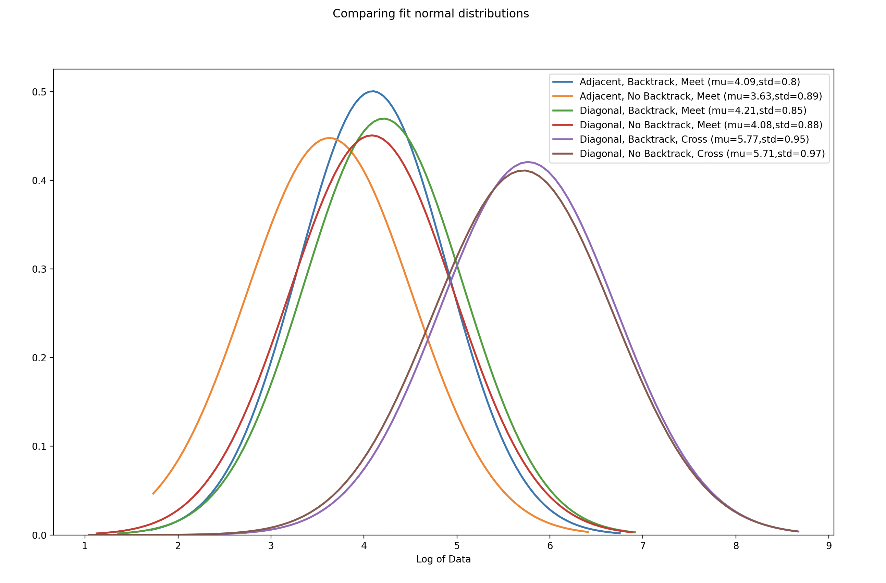

# Ants
> Two ants start in opposite corners of a regular chessboard. Every 10 seconds, they move from the center of the square they're on to the center of an adjacent square. How long until they both land on the same square? How long until their paths cross (Ant A moving from square K to L and Ant B moving from square L to K)? What happens if we allow the ants to move diagonally? What happens if we restrict ants from moving to their immediately previous square?

## **Key Result**

The prediction for time taken is summarized here:

<table><thead><tr><th>Backtrack</th><th>True</th><th>False</th><th>True</th><th>False</th><th>True</th><th>False</th><th>True</th><th>False</th></tr></thead><tbody><tr><td>Diagonal</td><td>False</td><td>False</td><td>True</td><td>True</td><td>False</td><td>False</td><td>True</td><td>True</td></tr><tr><td>Objective</td><td>Meet</td><td>Meet</td><td>Meet</td><td>Meet</td><td>Cross</td><td>Cross</td><td>Cross</td><td>Cross</td></tr><tr><td>Time (s)</td><td>849</td><td>570</td><td>965</td><td>704</td><td colspan="2">Not Possible</td><td>4568</td><td>3546</td></tr></tbody></table>

## **Approach**

1) Run N simulations for the different input cases.

2) Fit a distribution to the sample generated for each case using distfit (https://pypi.org/project/distfit/)

3) Estimate the time taken as the mean of the distribution that best fits.

4) Based on initial analysis, force a lognormal distribution on each sample. This allowed for a comparison of the impact of each variable in the problem: Backtrack, Diagonal and success condition (meet or cross).

## **Results**

>Note: The results below can be replicated by using seed 1 `random.seed(1)` in `main.py` or similar results can be obtained by running the code directly without forcing a seed

For each case, 10,000 simulations were performed (this number provided a right balance for speed and statistical confidence), and the results are summarised below:

#### **Full Summary**
<table><tr><th colspan="3" valign="top">Test Name</th><th valign="top"></th><th colspan="2" valign="top">KS D-statistic (goodness of fit)</th><th colspan="2" valign="top">Expected time (seconds)</th></tr>
<tr><td valign="top">Backtrack</td><td valign="top">Diagonal</td><td valign="top">Objective</td><td valign="top">Distribution</td><td valign="top">Best fit</td><td valign="top">Lognormal</td><td valign="top">Best fit</td><td valign="top">lognormal</td></tr>
<tr><td valign="top">True</td><td valign="top">False</td><td valign="top">Meet</td><td valign="top">Lognormal</td><td valign="top">0.023</td><td valign="top">0.023</td><td valign="top">849</td><td valign="top">849</td></tr>
<tr><td valign="top">False</td><td valign="top">False</td><td valign="top">Meet</td><td valign="top">Gamma</td><td valign="top">0.017</td><td valign="top">0.035</td><td valign="top">570</td><td valign="top">588</td></tr>
<tr><td valign="top">True</td><td valign="top">True</td><td valign="top">Meet</td><td valign="top">Lognormal</td><td valign="top">0.031</td><td valign="top">0.031</td><td valign="top">965</td><td valign="top">965</td></tr>
<tr><td valign="top">False</td><td valign="top">True</td><td valign="top">Meet</td><td valign="top">Beta</td><td valign="top">0.025</td><td valign="top">0.032</td><td valign="top">705</td><td valign="top">877</td></tr>
<tr><td valign="top">True</td><td valign="top">False</td><td valign="top">Cross</td><td colspan="5" rowspan="2" valign="top">*Not possible for ants to meet (explained below)</td></tr>
<tr><td valign="top">False</td><td valign="top">False</td><td valign="top">Cross</td></tr>
<tr><td valign="top">True</td><td valign="top">True</td><td valign="top">Cross</td><td valign="top">Gamma</td><td valign="top">0.018</td><td valign="top">0.035</td><td valign="top">4568</td><td valign="top">4788</td></tr>
<tr><td valign="top">False</td><td valign="top">True</td><td valign="top">Cross</td><td valign="top">Beta</td><td valign="top">0.017</td><td valign="top">0.037</td><td valign="top">3546</td><td valign="top">4630</td></tr>
</table>

### **Parameter analysis**

From the above, there are 3 variables which were compared by forcing a lognormal distribution: 

`Backtrack (bool)`, `Diagonal (bool)` and `Objective (str)`. 

The appropriateness of this was studied visually and using the Kolmogorov-Smirnov (KS) test as a measure of ‘goodness of fit’ (see table above). The visual comparison is shown below where the log of the times taken is plotted as a histogram vs the underlying normal distribution backed out from the fitted lognormal distribution. This method seems to have a mixed accuracy across the board due to deviation visibile from the theoretical normal distribution in certain plots.

Overall, despite this deviation, this method still seems sufficiently robust to analyse the trends. This can be seen in the chart below:

The first pattern of note is the impact of `Backtrack`. All other things being equal, `Backtrack=False` reduces the time taken to meet as can be seen for all 3 test cases where `Backtrack` changes from `False` to `True`. For example, when `Diagonal=False` and `Objective=SAME`, the impact of `Backtrack` is to reduce the average time by around `260s`. It should be noted that `Backtrack` has the biggest impact when `Diagonal=False` as the allowed number of moves (in most cases) goes from 4 to 3 i.e. a 25% reduction (when `Diagonal=True`, the number of allowed move goes from 8 to 7 (12.5% reduction only)). The second pattern noticed comes from setting `Diagonal=True`, where we can see a higher expected time and also a higher standard deviation in the plots compared to `Diagonal=False`. This suggests that despite the theoretical minimum (4 moves) being lower, the additional moves an ant can make from any given square increases both the time taken on average to meet and variation in these times. Finally, setting `Objective=CROSS`, we can see the biggest jump in time taken to around `4700s` (and increase in standard deviation too). This intuitively also makes sense as to cross paths, they must go onto opposite colour squares despite starting on the same colour square. This additional complexity is seen in the results.

> It should be noted that the analysis above and table below only serve to outline the impact of the variables and not to predict the time taken. The time taken estimate is summarized in the 'Key Result' section where we look at the expectation of the best fit distribution.

<table><thead><tr><th>Backtrack</th><th>True</th><th>False</th><th>True</th><th>False</th><th>True</th><th>False</th></tr></thead><tbody><tr><td>Diagonal</td><td>False</td><td>False</td><td>True</td><td>True</td><td>True</td><td>True</td></tr><tr><td>Objective</td><td>Meet</td><td>Meet</td><td>Meet</td><td>Meet</td><td>Cross</td><td>Cross</td></tr><tr><td>Time (s) (lognormal  mean)</td><td>849</td><td>588</td><td>965</td><td>877</td><td>4788</td><td>4630</td></tr></tbody></table>

For the case where `Objective=CROSS` and `Diagonal=False` (`Backtrack=TRUE or FALSE`), they cannot meet. The logic here is simple: to cross they must end up on different colour squares and this is not possible with adjacent moves only and starting on the same colour square. 

#### **Variable Impact Summary**
|Variable|Backtrack|Diagonal|Meet or Cross|
| :- | :- | :- | :- |
|Impact|Medium|Low|High|
