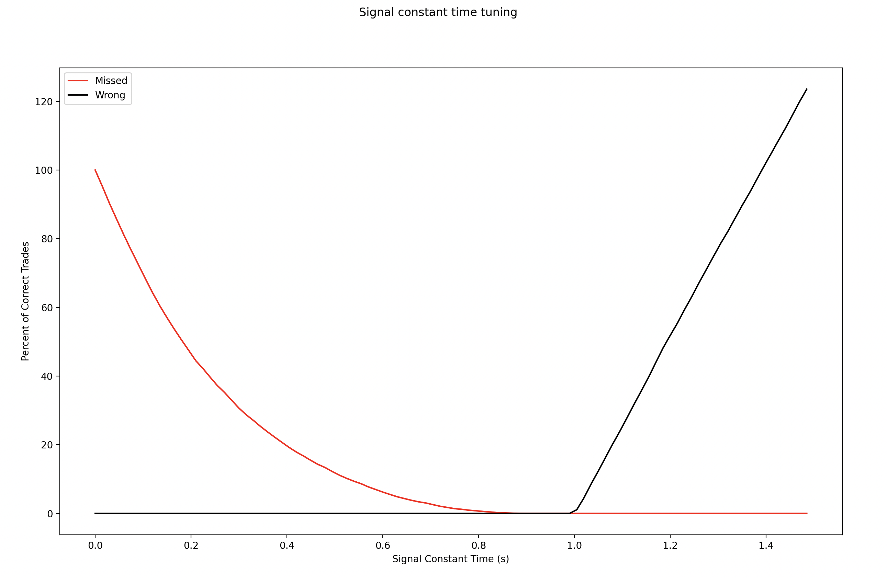
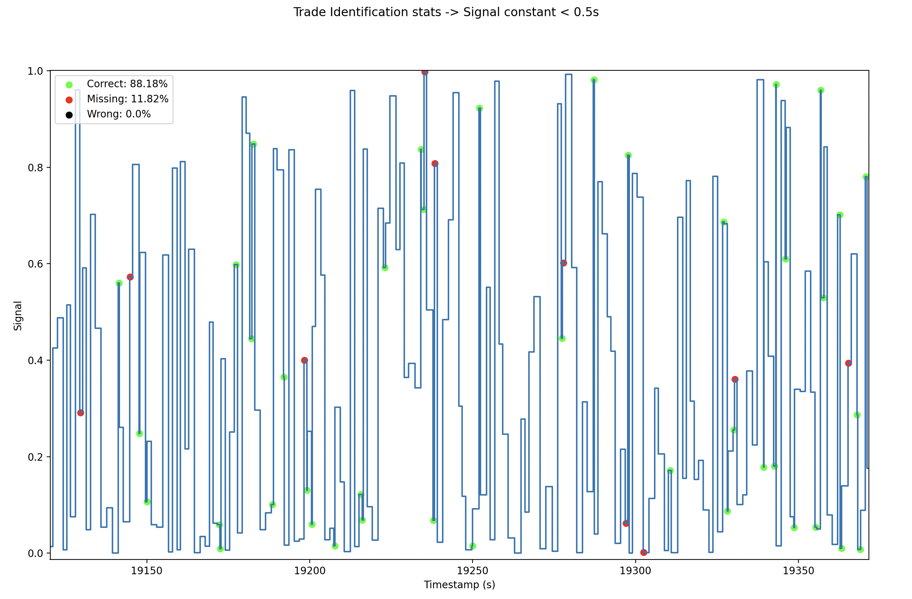
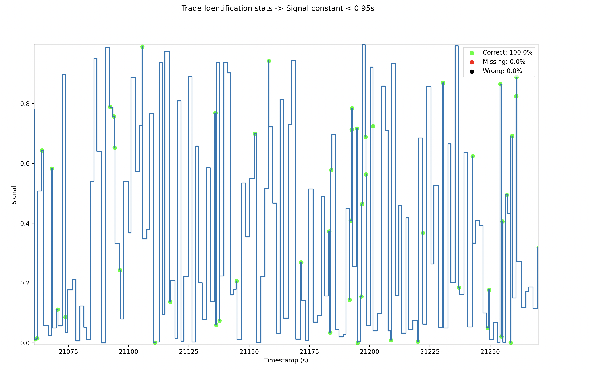
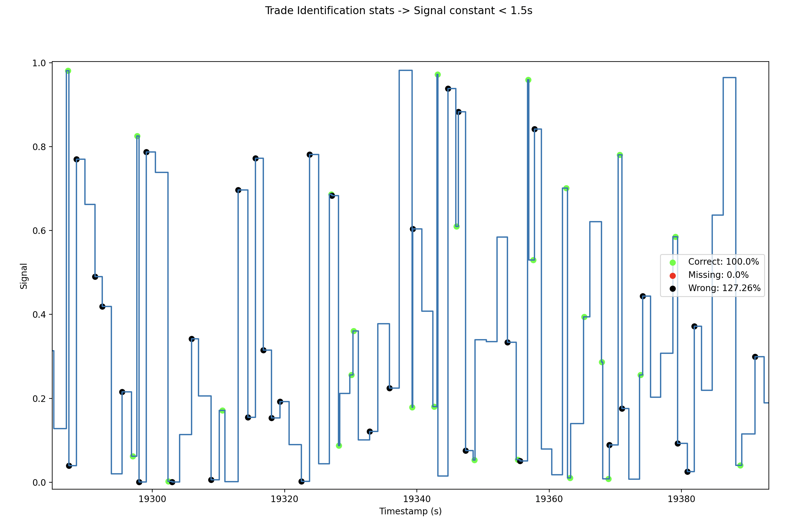

# Signal Processing

>First two columns: the time series of the signal.
>
> So you can see that between times 0 and 0.182162 the signal was 0.0498… then it was 0.0638 until time 1.881267 etc…
> 
> The other column "Trade Timestamps" is a list of trades. So you can see the first trade happened at time 0.021807, the next trade at time 11.46907
> 
> We think the signal might be linked to the arrival of trades, what do you think?

## Approach

The goal was to try and identify a pattern between the signal data and trade data. The general methodology was as follows:

1. Align the time series data for trades and the signal. Visually inspect the patterns.
2. Utilize different methods to attempt to find trends (seasonality, cyclicality, or noise)
3. The methods attempted were Fourier Transform signal attenuation, Z-score rolling outlier detection and signal leading/falling edge analysis.
4. Leading/falling edge analysis proved strongest, and a grid search was performed to tune hyperparameters.

## Results

Overall, it was identified that when the signal stayed constant for less than `N seconds`, there was a trade arriving/identified in the trade data. The parameter N was tuned using a grid search from `0.5 to 1.5 seconds`, with the following results:

As evident, there was a parabolic increase in the percentage of trades identified as N was increased while `N > 0.9s` seconds ensured all trades were identified. However, as `N > 1s`, the number of incorrect predictions increased linearly, exceeding 100% of the number of trades as `N > 1.4s`. Therefore, a working window of `0.9s <= N <= 1s` was identified. The full pattern is documented here:

| N | Correct (%) | Missing (%) | Wrong (%) |
|:---:|:---:|:---:|:---:|
| Between 0.9s to 1s | 100 | 0 | 0 |
| Less than 0.9s | < 100 | > 0 | 0 |
| Greater than 0.9s | 100 | 0 | > 0 |

The full signal and trade data is plotted in the figures below. To demonstrate the impact of N, different comparisons are done where the constant time window is set to 0.5s, 0.95s and 1.5s.
> Note: The figures are arbitrarily zoomed in to make it easier to identify the colour patterns. The user can run the code and look at the full picture in the interactive plots.

### 0.5s Time Window: Some trades were missed

### 0.95s Time Window: All trades were picked up and no wrong predictions

### 1.5s Time Window: All trades were picked up but there was also wrong predictions

