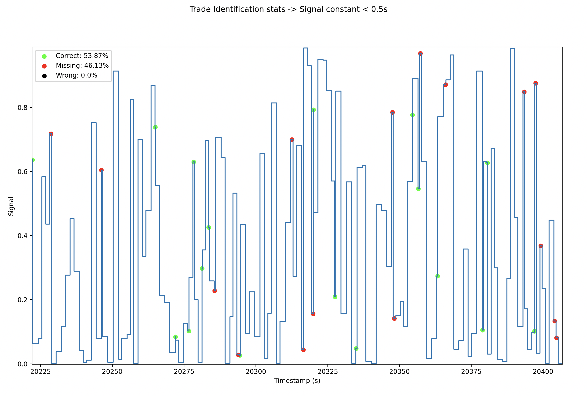

# Signal Processing

>First two columns: the time series of the signal.
>
> So you can see that between times 0 and 0.182162 the signal was 0.0498… then it was 0.0638 until time 1.881267 etc…
> 
> The other column "Trade Timestamps" is a list of trades. So you can see the first trade happened at time 0.021807, the next trade at time 11.46907
> 
> We think the signal might be linked to the arrival of trades, what do you think?

## Key Result

The signal is indeed linked to the arrival of trades. In particular, if the `signal stayed constant for 1s or less`, there was a trade arriving/identified in the trade data.

## Approach

The goal was to try and identify a pattern between the signal data and trade data. The general methodology was as follows:

1. Align the time series data for trades and the signal. Visually inspect the patterns.
2. Utilize different methods to attempt to find trends (seasonality, cyclicality, or noise)
3. The methods attempted were Fourier Transform signal attenuation, Z-score rolling outlier detection and signal leading/falling edge analysis.
4. Leading/falling edge analysis proved strongest, and a grid search was performed to tune hyperparameters.

## Results

It was identified that the signal is linked to the arrival of trades by the following pattern:

`If the signal stayed constant for 1s or less, there was a trade arriving/identified in the trade data.`

The parameter N was introduced, where `N=signal constant for less than N seconds`. This was tuned using a grid search from `0.5 to 1.5 seconds` (identified via trial and error), with the following results:

As evident, there was a linear reduction in the percentage of trades missed as N was increased up to `N = 1s`, when all trades were identified. However, as `N > 1s`, the number of incorrect predictions increased linearly, exceeding 100% of the number of trades as `N > 1.4s`. Therefore, the optimal value is `N = 1s`.

| N | Correct (%) | Missing (%) | Wrong (%) |
|:---:|:---:|:---:|:---:|
| 1s | 100 | 0 | 0 |
| Less than 1s | < 100 | > 0 | 0 |
| Greater than 1s | 100 | 0 | > 0 |

The full signal and trade data is plotted in the figures below. To demonstrate the impact of N, different comparisons are done where the constant time window is set to 0.5s, 1s and 1.5s.
> Note: The figures are arbitrarily zoomed in to make it easier to identify the colour patterns. The user can run the code and look at the full picture in the interactive plots.

### 0.5s Time Window: Some trades were missed

### 1s Time Window: All trades were picked up and no wrong predictions

### 1.5s Time Window: All trades were picked up but there was also wrong predictions

## Signal Profiling

The analysis thus far has identified a clear link between the signal and the trades. With this knowledge, the underlying signal can be profiled by decomposing the signal as follows: `Signal = Signal Base + Trade Impact`

### Base Signal

Through this decomposition, it is identified that the signal base is noise that stays constant between 1 to 2 seconds before arbitrarily varying between different signal strengths. The noise can be said to have 2 characteristics: `Step (time signal stays constant)` and `Strength (intensity of the signal at any point)`. The `Step` can be modelled as follows and seen graphically below:

`X~U(1,2)` where `X = Signal Step in seconds (time the signal stays constant for)`

The `Strength` of the signal, with the information given, doesn't provide much insight. However, we can see the majority of the time, the signal has quite low strength. With further information about the trade, this could have some meaning e.g. trade notional could be represented by signal strength.

### Trade and Signal Processing Time

One can also try to interpret the time taken between a trade arriving and the signal changing (`processing time`). For example, it could be that this is the time taken for 'our' trading system to process the incoming trade e.g. update internal risk measures and/or update bid/offer spreads based on the direction of the trade. The longer processing times could be related to more involved positions (e.g. index or derivative contracts) while the more frequent, shorter times could be related to a simple spot trade. Further information would be required to figure out the specific nature of the 2 signals. However, as part of initial analysis, the distribution (histogram) of time taken between the trade arriving and the signal changing is shown here:

