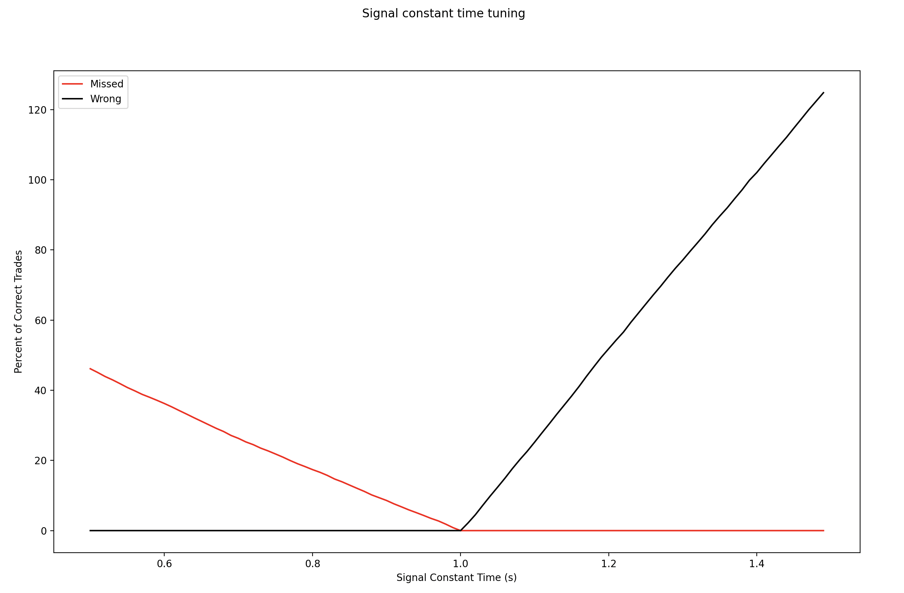

# Signal Processing

>First two columns: the time series of the signal.
>
> So you can see that between times 0 and 0.182162 the signal was 0.0498… then it was 0.0638 until time 1.881267 etc…
> 
> The other column "Trade Timestamps" is a list of trades. So you can see the first trade happened at time 0.021807, the next trade at time 11.46907
> 
> We think the signal might be linked to the arrival of trades, what do you think?

## Approach

The goal was to try and identify a pattern between the signal data and trade data. The general methodology was as follows:

1. Align the time series data for trades and the signal. Visually inspect the patterns.
2. Utilize different methods to attempt to find trends (seasonality, cyclicality, or noise)
3. The methods attempted were Fourier Transform signal attenuation, Z-score rolling outlier detection and signal leading/falling edge analysis.
4. Leading/falling edge analysis proved strongest, and a grid search was performed to tune hyperparameters.

## Results

Overall, it was identified that when the signal stayed constant for less than N seconds, there was a trade arriving/identified in the trade data. The parameter N was tuned using a grid search from 0.5 to 1.5 seconds, with the following results:

As evident, there was a parabolic increase in the percentage of trades missed as N was reduced while N \> 0.9 seconds ensured all trades were identified. Conversely, as N was increased past 1 second, the number of incorrect predictions increased linearly past 100% of the number of trades as the time window exceeded 1.4 seconds. Therefore, a working window of between 0.9 to 1seconds is identified within which the number of missing trades = 0 and number of wrong predictions = 0.

The full signal and trade data is plotted in the figures below. To demonstrate the point, different comparisons are done where the constant time window is set to 0.5s, 0.95s and 1.5s.

